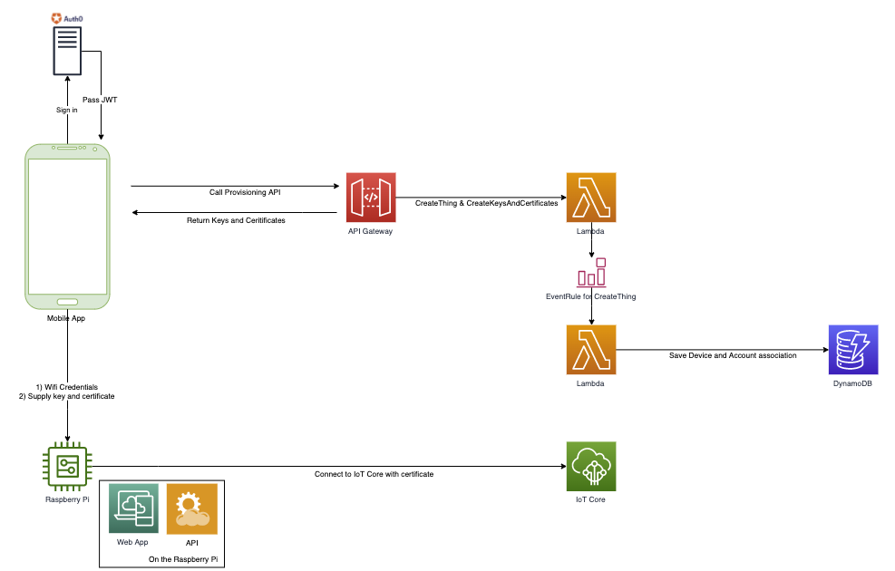

# AWS-Trusted-User-Provisioning-With-Auth0

## Description 
Demo of how one can provision an IoT Device using AWS and Auth0. 

Assumptions:
- Storing certificates on the device during manufacturing is not possible/desired.
- Device is not an MCU

Use Cases:
- A technical end user deploys an edge gateway

## Setup
### Prereqs/Materials Needed
1. Sign up for a free Auth0 account
2. Have the AWS CLi installed and configured (https://docs.aws.amazon.com/cli/latest/userguide/cli-chap-welcome.html)
3. Raspberry Pi 3+B model or later

### Auth0
1. Sign into your Auth0 account
2. Create an application with the following values
    - Name: Provision
    - Type: Single Page Web Application
3. You will be redirect to the application page
4. Click on the "Settings" Tab and fill out the following fields
    - Allowed Callback URLs: https://localhost:3000, http://localhost:3000, http://127.0.0.1:3000, https://10.3.141.1:3000/
    - Allowed Logout URLs: https://localhost:3000, http://localhost:3000, http://127.0.0.1:3000, https://10.3.141.1:3000/
    - Allowed Web Origins: https://localhost:3000, http://localhost:3000, http://127.0.0.1:3000, https://10.3.141.1:3000/
5. Save changes
6. Create an API with the following values:
    - Name: AWS JWT Authorizer
    - Identifier: https://auth0-jwt-authorizer

### AWS 
1. Sign into the AWS console
2. Go to the IAM service
3. Go to Identity Providers 
4. Create a Provider with the following values:
    - Provider Type: SAML
    - Provider Name: auth0
    - Metadata Document: Upload the file containing the Auth0 metadata, found in Auth0 Dashboard > Applications > Application Settings > Advanced Settings > Endpoints > SAML Metadata URL
5. Run `sls deploy --aws-profile <YOUR_AWS_CLI_PROFILE>`
6. Login into the AWS Console
7. Navigate to the newly provisioned API Gateway
8. Click on the createThingAndCredentials method
9. Click on Integration Response
10. Enable CORS option on API Gateway by adding the following values to the integration response:
    - Access-Control-Allow-Headers: 'Content-Type,X-Amz-Date,Authorization,x-api-key,x-amz-security-token'
    - Access-Control-Allow-Methods: 'POST, OPTIONS'
    - Access-Control-Allow-Origin: '*'

### Raspberry Pi
All commands below are to be run on your Raspberry Pi
1. Flash a fresh install of Raspbian Lite onto your Raspberry Pi
2. Run `git clone https://github.com/BraedenQ/AWS-Trusted-User-Provisioning-With-Auth0.git`
3. Run `sudo raspi-config`
4. Configure WLAN and keyboard accordingly
5. Enable SSH
6. Navigate into the cloned repo and run the setup.sh script

## Run the Demo

### Provision A Thing
1. Connect your phone or laptop to `raspi-webgui` network
2. On your Raspberry pi, run the runServers.sh script
3. Use Google Chrome on your laptop or phone (the one you just connected to `raspi-webgui` network) to navigate to `https://10.3.141.1:3000/`. You may get a warning page. Click Advanced Options and Proceed Anyway. This is caused by the self-signed SSL certificate used for this demo.
4. You will see the Auth0 Demo page. Click Sign In on the top right.
5. Create an account and login using the provided Auth0 sign in page
6. Once signed in, you will be redirected to the home page. If your sign in was successful, you should see initials in the top right in place of the Login button
7. Click the tab labeled External API
8. Click the Ping button. This will call out to the API Gateway using the JWT granted to your user. The API gateway will call a Lambda function that will create a thing, keys, and certs. You will see the cert/key appear in a box in the browser. that's how you'll know the API call was successful. (you can also check the browser console to ensure no errors occured)
9. [Optional] At this point, you can navigate to IoT Core in the AWS Console and see your provisioned Thing.
10. Note: At this point, credentials have been saved into your `credentials` directory
### Connect the Thing
1. On your raspberry pi, run the connectDeviceToAws.sh script. You will see messages that are sent and recieved from IoT Core.

## Components

### Mobile-App
Web application derived from an Auth0 template project. Sign up for a free account [here](https://auth0.com/signup). The ExternalApi.js (src/views) file is where you will provide your API Gateway Endpoint.

### Local-API
A simple Express API that the mobile-app will call to save the Thing credentials created by AWS.

### API Gateway
API that calls ProvisionThing Lambda. A JWT is required from Auth0 in order to call this API.

### Lambda (Provision Thing)
Leverages the AWS-SDK do the following:
1) Create keys and a certificate
2) Create a Thing
3) Attach a policy to the certificate
4) Attach the certificate to the Thing

Returns the keys and certificate to be saved on the device.

### Lambda (Associate Thing)
Triggered after a createThing API call. This will associate the device to a user and save such into DynamoDB.

### DynamoDB
Stores the association between users and devices.

### References
1. https://auth0.com/docs/integrations/aws-api-gateway-delegation-1
2. https://auth0.com/docs/integrations/aws-api-gateway-delegation-2
3. https://auth0.com/docs/integrations/aws-api-gateway-delegation-3
4. https://auth0.com/docs/integrations/aws-api-gateway-delegation-4
5. https://auth0.com/docs/integrations/how-to-set-up-aws-for-delegated-authentication
6. SSL for React https://medium.com/@danielgwilson/https-and-create-react-app-3a30ed31c904
7. SSL for API https://dev.to/omergulen/step-by-step-node-express-ssl-certificate-run-https-server-from-scratch-in-5-steps-5b87
8. Change name to .crt instead of cert or pem https://www.raspberrypi.org/forums/viewtopic.php?t=204129